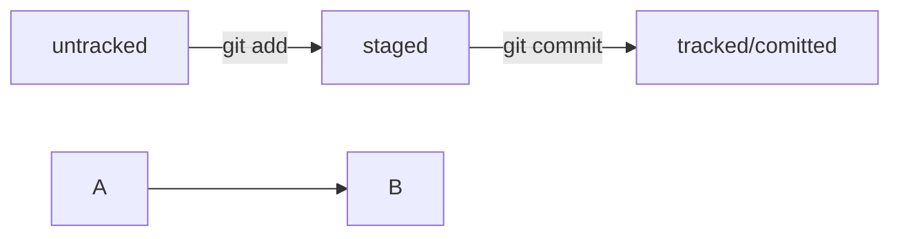

# s3cmd
&ensp;s3cmd - это **бесплатная утилита командной строки** и клиент для получения, отправки, управления данными в Amazon S3 и других облачных провайдеров хранения данных, которые используют протокол S3, такие как Google Cloud Storage, DreamHost DreamObjects, Yandex Object Storage.  
&ensp;Эта утилита больше всего подходит для пользователей, которые знакомы с командной строкой. Также она идеально подходит для выполнения задач в скриптах, к примеру, **автоматического резервного копирования данных в S3**, запущенных через планировщик cron, и других задач.

## Установка s3cmd

&ensp;Ubuntu: `apt install s3cmd`

## Настройка s3cmd
&ensp;Все указанные настройки сохраняются в *~/.s3cfg* (по умолчанию)

- `s3cmd --configure`

## Различные команды для просмотра, отправки, получения файлов

- `s3cmd ls`
- `s3cmd ls s3://bucketname`
- `s3cmd get s3://bucketname/file01 file01_local`
- `s3cmd --storage-class STANDARD put file01_local s3://bucketname/file01_remote`
- `s3cmd du s3://bucketname`
- `s3cmd info s3://bucketname/`
- `s3cmd info s3://bucketname/filename`
- `s3cmd modify --add-header=x-amz-meta-KEY:value s3://bucketname/remotefile`
- `s3cmd modify --remove-header=x-amz-meta-KEY s3://bucketname/remotefile`

## Синхронизация директорий

### Синхронизировать всю папку `local_dir` в хранилище
- `s3cmd sync local_dir s3://bucketname`

### Синхронизировать содержимое папки `local_dir` в в хранилище
- `s3cmd sync local_dir/ s3://bucketname`

### Mermaid scheme test

